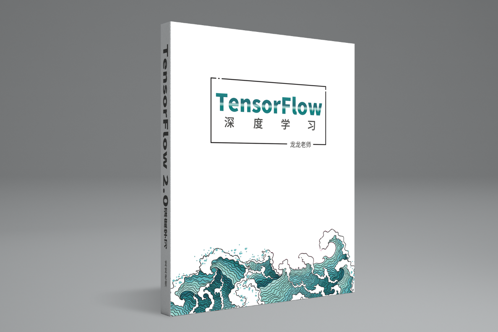

<!--
 * @Author: wuwuwu
 * @Date: 2020-01-29 09:50:35
 * @LastEditors  : wuwuwu
 * @LastEditTime : 2020-01-29 09:56:37
 * @Description: 
 -->
# 使用TensorFlow2.0学习深度学习
参照书籍以及教程中的例子，自己完成代码实现

[原书连接](https://github.com/dragen1860/Deep-Learning-with-TensorFlow-book)